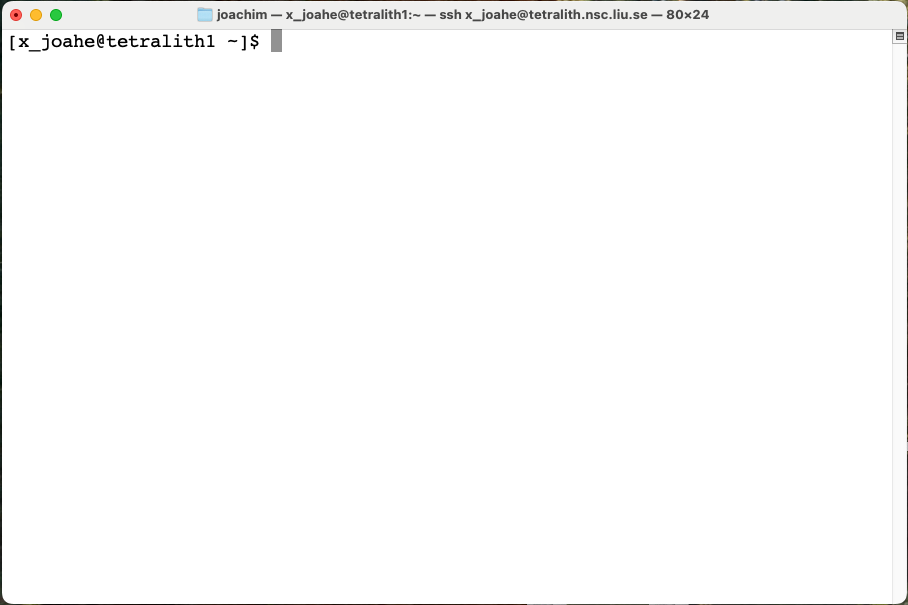

# The command line interface and the shell

!!! Note "Learning objectives" 

    **Questions**

    - What is a Command Line Interface (CLI)?
    - What is a shell?
    - Why/when should I use it?

    **Objectives**

    - You will learn about the shell and the CLI.
    - You will learn why and when you should use a CLI instead of a Graphical User Interface (GUI). 
    
{: style="width: 400px;float: right;padding: 3px;}

The picture above shows a terminal window where a user is logged into NAISS' Tetralith system.  Inside the terminal there is a **shell** running. One can see the **prompt** waiting for user input.  

This is an example for a command line interface (CLI).  It allows interacting with the computer system by directly typing commands. It is a user interface that is navigated with only a keyboard, instead of by clicking with a mouse or using a touchscreen.
 
A commandline interface is currently available in all major operating systems, including Windows, UNIX, Linux and macOS.

!!! NOTE 

    In Unix or Linux, the **prompt** may be shown as ``$``, ``%``, ``#``, or ``>`` depending on the shell used and the system's set-up.  In addition it may show details such as the user name, the name of the system or the position in the directory tree.  The late is commonly referred to as the ``PATH``.

    The prompt means the shell is waiting for input from you. 
   
A common alternative to a CLI is a **GUI** (Graphical User Interface), typically uses a mouse or similar for navigating.  While for a new user a GUI is often more intuitive the CLI is more powerful.  Command line interfaces often give access to more capabilities than the graphical user interface does.  Many repetive tasks, which can be tedious in a GUI, can be easily automated in a shell with a shell with command line interface.

## Shell 

As mentioned in the intro, the shell is a special user program. It is an interface between the keyboard and the computer's operating system (OS), i.e., it takes input from the user via the keyboard and sends it to the OS, which then performs the actions requested.  

In this course we will be focusing on **Bash** (**B**ourne **A**gain **SH**ell).   There are many alternatives and the commands can look quite different when using another shell than Bash.
Bash is a command-line interpreter providing a Command Line Interface (CLI), as well as a scripting language.

Writing scripts in a shell allows you to automate repetitive tasks or combine several tasks, making your workflow faster and more efficient. For example: if you want to iterate over many files, this can be done easily in the shell. 

!!! Warning 

    You will find that many/most commands in this course are prefaced with either <code>\$</code> or <code>[user@tetralith1 ~]\$</code>, or something like <code>[user@tetralith1 us]\$</code>. 

    This is the prompt from the computer system, where <code>\$</code> just is the default (<code>bash</code>) prompt, and the others are examples of a prompt you may see when logged into a compute cluster (in this case Tetralith - home directory versus a project storage directory).

    You can see an example of such a prompt in the picture a bit further up on the page, when a user with the user-id  <code>x_joahe</code> is connected to NAISS' Tetralith system.

    **IMPORTANT**

    Do **NOT** copy the prompt if you are copying code snippets. It should **not** be included in the command. 

## Terminology

You may here words such as shell, terminal, console, and command line interface. So what are the differences? Are they the same? 

Short answer:

- terminal = text input/output environment
- console = physical terminal
- shell = command line interpreter

??? "Slightly longer answer (CLICK to read)"

    - Console and terminal were original an actual device much like a typewriter which was used to interact with the computer. It was sometimes called a teletypewriter (tty). 
    - A **terminal** in Linux/Unix terminology is a device file (interface to a device driver) which implements some commands (read, write, and some more). Some terminal emulators: xterm, Gnome terminal, Konsole, ssh, ...
    - A **console** is generally a terminal in the physical sense; i.e. often the primary terminal directly connected to a machine. On Linux the console appears as several terminals that can be switched between, and each of these can be named console, virtual console, virtual terminal, etc. 
    - A **Command line interface** is an interface where the user types a command and then presses RETURN/ENTER to execute the command.
    - A **shell** is the main interface seen by the user when they login. It is used to start other programs. It is a command-line shell, and there are many different ones, as mentioned earlier. Command-line shells include flow control constructs to combine commands. In addition to typing commands at an interactive prompt, users can write scripts. 

## Try it out 

!!! question "Exercise: Open a terminal" 

    Do **one** of the following: 

    1. Tetralith
        - Use an SSH client of your choice or <a href="http://www.cendio.com/thinlinc/what-is-thinlinc" target="_blank">ThinLinc</a>
        - Log in with your USERNAME: 
        ```bash
        ssh USERNAME@tetralith.nsc.liu.se
        ```
        - If you logged in with ThinLinc, open a terminal
    2. Open a terminal on any other HPC system of your choice
    3. Open a terminal on your own computer 

!!! Exercises "Code-along: try a few commands"

    NOTE: These commands will all be described in more details in the next section about [Navigating the File System](filesystem.md) 

    List some files and directories:
    ```bash
    ls
    ```

    Create a file (name it anything - MYFILE.txt is just a placeholder):
    ```bash
    touch MYFILE.txt
    ```

    Create a directory (name it anything - MYDIR is just a placeholder):
    ```bash
    mkdir MYDIR
    ```

    List your files and directories again: 
    ```bash
    ls
    ```

## Error messages 

!!! error "Error messages"

    If you misstype a command, or the program/script is not available, you will get an error message, like this (on Tetralith where username is x_birbr): 

    ```bash
    [x_birbr@tetralith3 ~]$ ks
    -bash: ks: command not found
    [x_birbr@tetralith3 ~]$  
    ```

    it may look a little different depending on the system (e.g., on defiant where username is bbrydsoe): 

    ```bash
    bbrydsoe@defiant:~$ ks
    ks: command not found
    bbrydsoe@defiant:~$ 
    ```

    If you instead execute a command on a file which is not available (or not accessible, due to **permissions**), it will look like this (you can use ``ls`` to list a specific file also): 

    ```bash
    [x_birbr@tetralith3 ~]$ ls myfile.c
    ls: cannot access 'myfile.c': No such file or directory
    [x_birbr@tetralith3 ~]$ 
    ```

!!! Success "Keypoints" 

    - A shell is a special user program. It is an interface between the keyboard and the operating system that takes input from the user and sends it to the OS, which then performs the actions requested.
    - We will use ``bash`` in this course.
    - You can run programs from the shell by entering commands at the command-line prompt.
    - There are many advantages to using the shell, particularly the ability to automate repetitive tasks and combine smaller tasks in a script, as well as the speed of executing commands compared with the often more resource-heavy GUI. The shell is also easier to use remotely.
    - A difficulty with the shell can be finding out which commands exist and how to run them.

